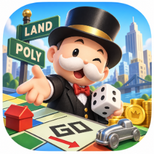
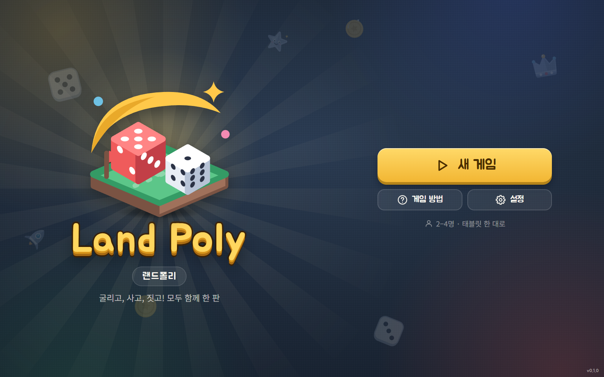
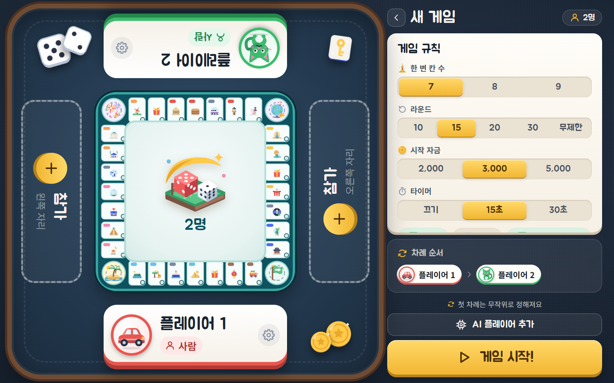
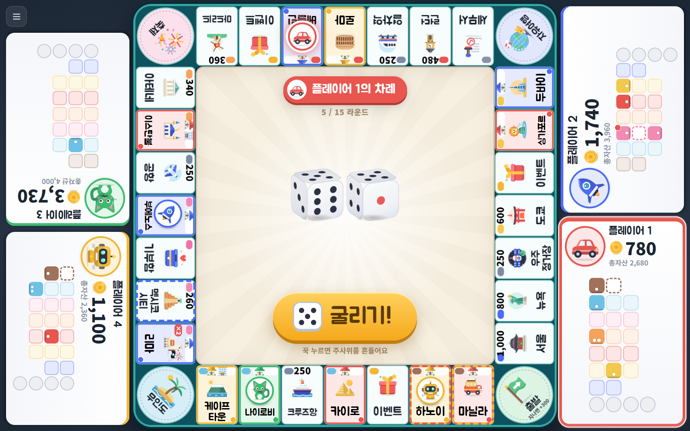
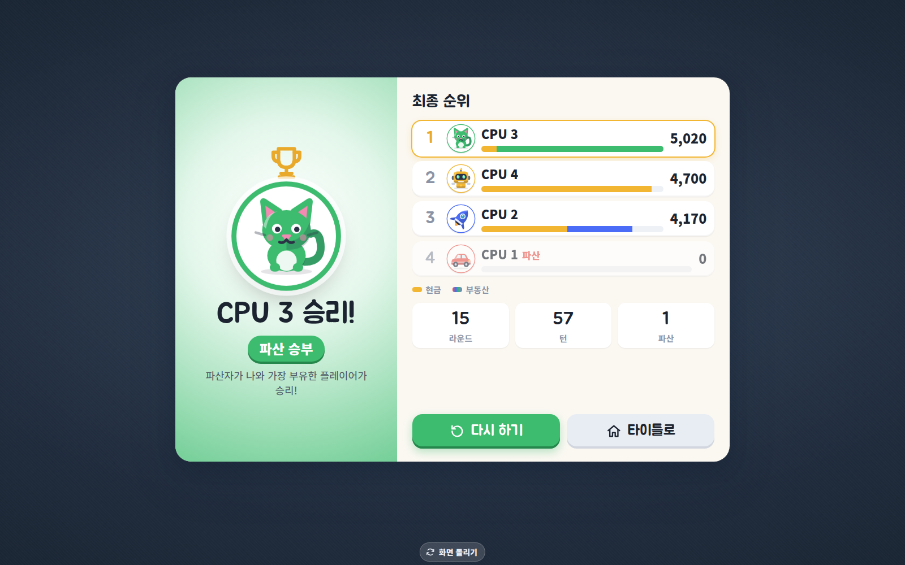

# Land Poly (랜드폴리)



**태블릿 한 대를 테이블 한가운데 놓고 2~4명이 둘러앉아 즐기는 20~30분짜리 도시 수집 보드게임.**
주사위를 굴려 기본 19개, 확장 보드에서는 최대 27개 도시를 사고, 짓고, 인수하세요. 내 차례가 되면 게임판 한가운데의 무대(스테이지)가
내 쪽으로 회전해서 거꾸로 된 글씨를 읽을 일이 없습니다. 광고, 계정, 인터넷 모두 필요 없는 **완전 오프라인** 게임입니다.

- 패스 앤 플레이: 태블릿 1대, 2~4명 (AI 쉬움·보통 지원)
- 한 변 칸 수 7·8·9 선택: 총 32·36·40칸, 기본 7칸
- 회전하는 스테이지와 각 자리를 향한 플레이어 패널
- 세계 19개 도시, 별장 -> 빌딩 -> 호텔 -> 명소 건설, 인수, 축제, 자유여행, 무인도, 이벤트 카드 24종
- 승리 조건: 파산, 라운드 제한(총자산), 3색 독점, 한 변 독점, 허브 독점
- 시드 기반 결정적 엔진 (같은 시드 = 같은 게임), 순수 함수 리듀서
- 한국어(기본) / 영어, Web Audio로 합성한 효과음, 진동 피드백
- Vite + TypeScript(프레임워크 없음), Capacitor 8로 Android 패키징 (앱 ID `com.bigssu.lotandroll`)

## 스크린샷

| 타이틀 | 세팅 | 게임 | 결과 |
|---|---|---|---|
|  |  |  |  |

> `npm run e2e` 가 만든 `e2e/__screenshots__/` 의 이미지(1600×1000)를 `docs/assets/screenshot-*.png` 로 복사한 것입니다
> (타이틀·세팅: `shell-*`, 게임: `human-4p-mid-1600x1000.png`, 결과: `human-result-facing-S-1600x1000.png`). 스토어용 규격은 [docs/PLAY_LISTING.md](docs/PLAY_LISTING.md) 5.1장을 보세요.

## 실행하기

Node.js 22.12 이상이 필요합니다.

```bash
npm i
npm run dev          # http://localhost:5173  (가로 태블릿 크기 창 권장)
```

새 게임에서 **AI 플레이어 추가**를 누르면 빈 자리에 AI가 들어갑니다. 플레이어 카드를 눌러 사람/AI 및 난이도를 바꿀 수 있습니다.
**게임 규칙 → 한 변 칸 수**에서 7·8·9를 선택하면 미리보기와 게임판이 함께 바뀝니다. 기존 저장 게임은 7칸 보드로 이어집니다.

빌드 결과는 `npm run build` 후 `npm run preview -- --port 4179`로 실행하고 `http://localhost:4179`에 접속하세요.
`dist/index.html`을 직접 더블클릭하면 브라우저의 로컬 파일 제한 때문에 게임 스크립트가 실행되지 않습니다.

| 명령 | 설명 |
|---|---|
| `npm run dev` | 개발 서버 (Vite) |
| `npm run typecheck` | `tsc --noEmit` 타입 검사 |
| `npm test` | 단위 테스트 (Vitest): 엔진의 모든 규칙, 승리 조건, 파산, 저장/불러오기 |
| `npm run test:watch` | 테스트 감시 모드 |
| `npm run sim` | CPU 4명 x 500판 밸런스 시뮬레이션 리포트 (`scripts/balance.ts`, 옵션은 [docs/BALANCE.md](docs/BALANCE.md)) |
| `npm run e2e` | Playwright e2e + 스크린샷 (`e2e/__screenshots__/`). 처음에는 `npx playwright install chromium` 필요 |
| `npm run build` | 타입 검사 + 프로덕션 빌드 -> `dist/` |
| `npm run preview` | 빌드 결과 미리보기 |

## Android 빌드

```bash
npm ci
npm run build
npx cap sync android
cd android && ./gradlew assembleDebug      # app/build/outputs/apk/debug/LandPoly-debug.apk
```

JDK 21, Android SDK 36, 릴리스 서명, 버전 관리, Google Play 제출 체크리스트는 **[docs/RELEASE.md](docs/RELEASE.md)** 를 보세요.
GitHub Actions(`.github/workflows/android.yml`)가 push마다 debug APK를 만들고, 서명 시크릿이 있으면 AAB/APK 릴리스도 만듭니다.

## 프로젝트 구조

```text
src/
  engine/     순수 게임 엔진: reducer, rules, economy, AI, save, sim, RNG (+ __tests__)
  content/    보드 32칸, 이벤트 카드, 팔레트, SVG 아이콘 (모두 자체 제작)
  ui/         화면, 보드/스테이지/패널, 애니메이션 시퀀서, WebAudio 합성 사운드, 라우터
  i18n/       ko / en 문자열 (t('key')), 콘텐츠용 loc({ ko, en })
  styles/     디자인 토큰과 CSS
scripts/      밸런스 시뮬레이터, 아이콘 빌드/검사 스크립트
public/       벤더링한 글꼴 (Noto Sans KR, Jua — OFL)
docs/         설계, 밸런스, 릴리스, 개인정보처리방침, 스토어 등록정보, 조사 자료
android/      Capacitor Android 프로젝트 (npx cap add android 로 생성)
.github/      CI 및 Android 빌드 워크플로
```

## 문서

- [docs/DESIGN.md](docs/DESIGN.md): 게임 디자인 문서 (규칙, 보드, UX, 아키텍처)
- [docs/BALANCE.md](docs/BALANCE.md): 밸런스 조정 기록과 시뮬레이션 결과
- [docs/UI-CONTRACT.md](docs/UI-CONTRACT.md): UI 계약
- [docs/research/](docs/research/): 규칙, IP/라이선스, 기술 스택/Android 조사
- [docs/RELEASE.md](docs/RELEASE.md): 릴리스와 Play Console 가이드
- [docs/PLAY_LISTING.md](docs/PLAY_LISTING.md): 스토어 문구와 그래픽 에셋
- [docs/PRIVACY_POLICY.md](docs/PRIVACY_POLICY.md): 개인정보처리방침 (수집 데이터 없음)
- [docs/THIRD_PARTY_LICENSES.md](docs/THIRD_PARTY_LICENSES.md): 서드파티 라이선스

## 라이선스

- 소스 코드: [MIT](LICENSE), Copyright (c) 2026 bigssu
- 글꼴: Noto Sans KR, Jua 는 SIL Open Font License 1.1 (각 글꼴 폴더의 `OFL.txt`)
- 그림(아이콘, 로고, 일러스트)과 소리(Web Audio 합성 효과음)는 모두 이 프로젝트를 위해 직접 만든 오리지널입니다.
  게임 내부의 그림과 소리는 자체 제작입니다. 앱 아이콘은 사용자 제공 이미지이며 스토어 게시 전 권리 확인이 필요합니다. 자세한 내용은 [docs/THIRD_PARTY_LICENSES.md](docs/THIRD_PARTY_LICENSES.md).

---

## English

**Land Poly** is a fast (20-30 min), fully offline **pass-and-play** city-collecting board game for one tablet lying flat
on a table with 2-4 people around it. Roll the dice, buy, build and take over 19 world cities. The central stage rotates to
face whoever's turn it is, so nobody reads upside-down text. No ads, no accounts, no network, no analytics.

Tech: Vite + TypeScript (no framework), a deterministic pure-function game engine, hand-authored SVG art, Web Audio synthesized
sound, Capacitor 8 for Android (`com.bigssu.lotandroll`).

```bash
npm i && npm run dev     # develop (Node 22+)
npm test                 # unit tests (Vitest)
npm run sim              # balance simulation, 500 CPU games
npm run e2e              # Playwright e2e + screenshots
npm run build            # production build to dist/
```

Android: `npm run build && npx cap sync android && cd android && ./gradlew assembleDebug`.
Signing, versioning and the Google Play checklist are in [docs/RELEASE.md](docs/RELEASE.md) (Korean).
Design docs: [docs/DESIGN.md](docs/DESIGN.md), [docs/BALANCE.md](docs/BALANCE.md), [docs/research/](docs/research/).

License: code under MIT; bundled fonts (Noto Sans KR, Jua) under SIL OFL 1.1; all artwork and audio are original to this project.
